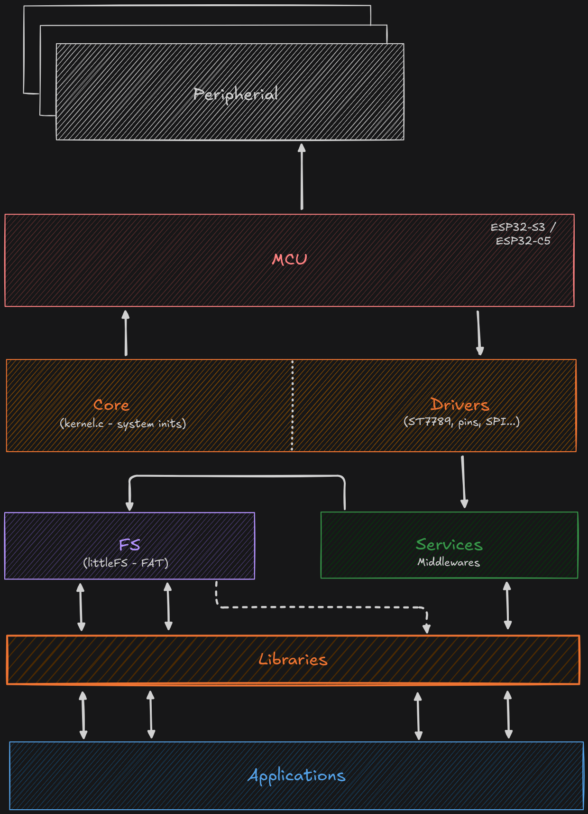

<p align="center">
  
</p>

---

# Firmware HighBoy (Beta)

[](LICENSE)
[](https://github.com/HighCodeh/TentacleOS/stargazers)
[](https://github.com/HighCodeh/TentacleOS/network/members)
[](https://github.com/HighCodeh/TentacleOS/pulls)

> **Idiomas**:  [🇺🇸 English](README.md) | [🇧🇷 Português](README.pt.md) 

Este repositório contém um **firmware em desenvolvimento** para a plataforma **HighBoy**.  
**Atenção:** este firmware está em **fase beta** e **ainda está incompleto**.

---

## Alvos Oficialmente Suportados

Estamos expandindo o suporte para os chips mais recentes da Espressif:

| Alvo | Status |
| :--- | :--- |
| **ESP32-S3** | Desenvolvimento Principal |
| **ESP32-P4** | Experimental (firmware_p4) |
| **ESP32-C5** | Experimental (firmware_c5) |

---

## Estrutura do Firmware

Diferente de exemplos básicos com um único `main.c`, este projeto utiliza uma estrutura modular organizada em **components**, que se dividem da seguinte forma:

- **Drivers** – Lida com drivers e interfaces de hardware.  
- **Services** – Implementa funcionalidades de suporte e lógica auxiliar.  
- **Core** – Contém a lógica central do sistema e gerenciadores principais.  
- **Applications** – Aplicações específicas que utilizam os módulos anteriores.

Essa divisão facilita a escalabilidade, reutilização de código e organização do firmware.

Veja a arquitetura geral do projeto:  
<p align="center">
  
</p>

--- 

## Como utilizar este projeto

Recomendamos que este projeto sirva como base para projetos personalizados com ESP32-S3.  
Para começar um novo projeto com ESP-IDF, siga o guia oficial:  
[Documentação ESP-IDF - Criar novo projeto](https://docs.espressif.com/projects/esp-idf/en/latest/api-guides/build-system.html#start-a-new-project)

### Estrutura inicial do projeto

Apesar da estrutura modular, o projeto ainda mantém uma organização compatível com o sistema de build do ESP-IDF (CMake).

Exemplo de layout:

```bash
├── CMakeLists.txt
├── components
│   ├── Drivers
│   ├── Services
│   ├── Core
│   └── Applications
├── main
│   ├── CMakeLists.txt
│   └── main.c
└── README.md
```

---

## Como Contribuir

Contribuições são o que fazem a comunidade open-source um lugar incrível para aprender, inspirar e criar. Qualquer contribuição que você fizer é **muito apreciada**.

1. Faça um Fork do projeto
2. Crie sua Feature Branch (`git checkout -b feat/AmazingFeature`)
3. Faça o Commit de suas alterações usando **Conventional Commits** (`git commit -m 'feat(scope): add some AmazingFeature'`)
4. Faça o Push para a Branch (`git push origin feat/AmazingFeature`)
5. Abra um Pull Request

Por favor, leia nosso [**CONTRIBUTING.md**](CONTRIBUTING.md) para mais detalhes sobre o estilo de codificação e processo de build.

---

## Nossos Apoiadores

Agradecemos especialmente aos parceiros que apoiam este projeto:

[](https://www.pcbway.com)

---

## Licença
Este projeto está licenciado sob a **Apache License, Version 2.0**. Veja o arquivo [LICENSE](LICENSE) para mais detalhes.
